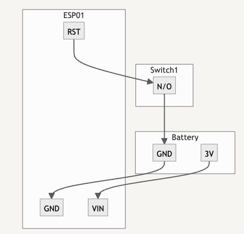

# meeeseeks
You can make props, you can buy boxes that talk... but what if Mr. Meeeseeks could control your thermostat?  

  
This project uses an ESP8266 and the VoiceMonkey.io website to integrate your homemade Meeeseeks box with Alexa. 
Because we're using the DeepSleep mode, 3xAA batteries should be able to power it for at least 6 months... Depending on how often you push the button.  
###  **Disclaimer** : This is an Art Project, not a display of Electrical Engineering Excellence. I have no idea what I'm doing, but this "works on my machine".
**Disclaimer #2** : Each box can only be configured to perform a single action.  
**Disclaimer #3** : Not responsible for any world-ending scenarios created by your local Jerry due to unsupervised usage.

### How it works
The included firmware is fairly simple:
- When the box turns on:
    - Connect to a saved WiFi network
    - Send a GET request to the stored URL
    - Go into Deep Sleep
- When you push the button ONCE:
    - Reset the box and perform the steps above
- When you push the button TWICE:
    - Start a WiFi Access Point
    - Wait for you to connect and configure the box
- If the box can't connect to WiFi:
    - Start a WiFi Access Point
    - Wait for you to connect and configure the box
 

### Parts List
1. [12mm Momentary Switch](https://www.amazon.com/gp/product/B09BKWMNJ9)
2. [3xAA Battery Holder, 4.5v](https://www.amazon.com/gp/product/B09MLRNC6N)
3. [ESP-01S](https://www.amazon.com/gp/product/B07KF134Y8)
4. [ESP-8266 Programmer](https://www.amazon.com/gp/product/B07Q17XJ36)
5. [Some jumper wires](https://www.amazon.com/gp/product/B0789F523N)
6. Lasercut box frame

### Required Libraries
1. [WiFiManager](https://github.com/tzapu/WiFiManager)
2. [ArduinoJSON](https://github.com/bblanchon/ArduinoJson)
3. [DoubleResetDetect](https://github.com/jenscski/DoubleResetDetect)

### Wiring Diagram
1. Connect GND of ESP01 to GND of your battery
2. Connect VIN of ESP01 to 3v battery pack
3. Connect RST of ESP01 to S1 of your switch
4. Connect S2 of your switch to GND of your battery
5. Profit.

### Create a Webhook
1. Visit https://voicemonkey.io/ and register for an account
2. Follow the VoiceMonkey setup instructions \(Sign in with Amazon, Install the VoiceMoney Alex App, etc.)
3. Create a new "Routine Trigger" device and give it a fun name like, "Mr. Meeeseeks"
4. Click "APIv2" > "Routine Trigger API" in the sidebar
5. Select the trigger you just created.
6. Click "Copy URL"

### Operation
1. Double clicking the button should cause your Mr. Meeeseeks box to restart in Config Mode
2. Connect the the access point "MeeeseeksWifi"
3. If a portal doesn't appear, browse to http://192.168.4.1
4. Select your network and enter your wifi password to connect Mr. Meeeseeks to the internet
5. Paste in the URL from the "Create a Webhook" Step 6.
6. Click "Save"
7. Your Meeeseeks box will now reboot. Push the button to trigger your event.

### Screenshots
